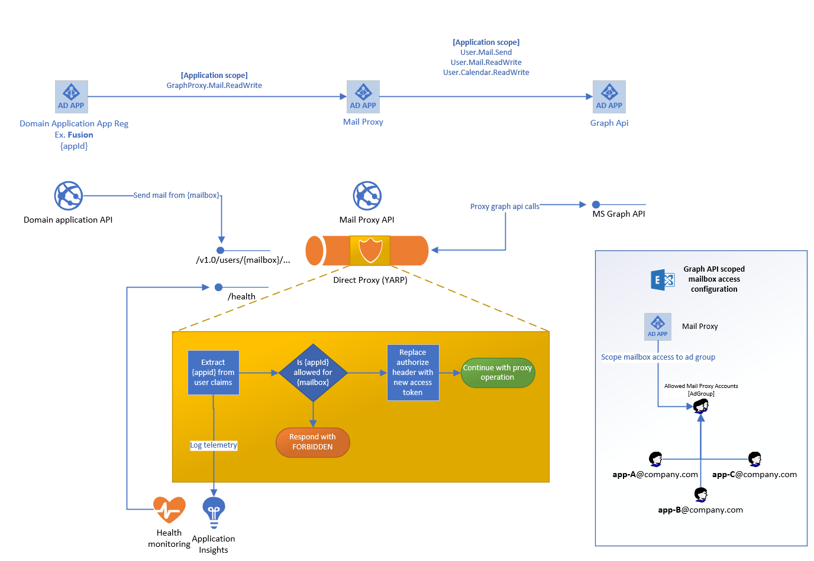
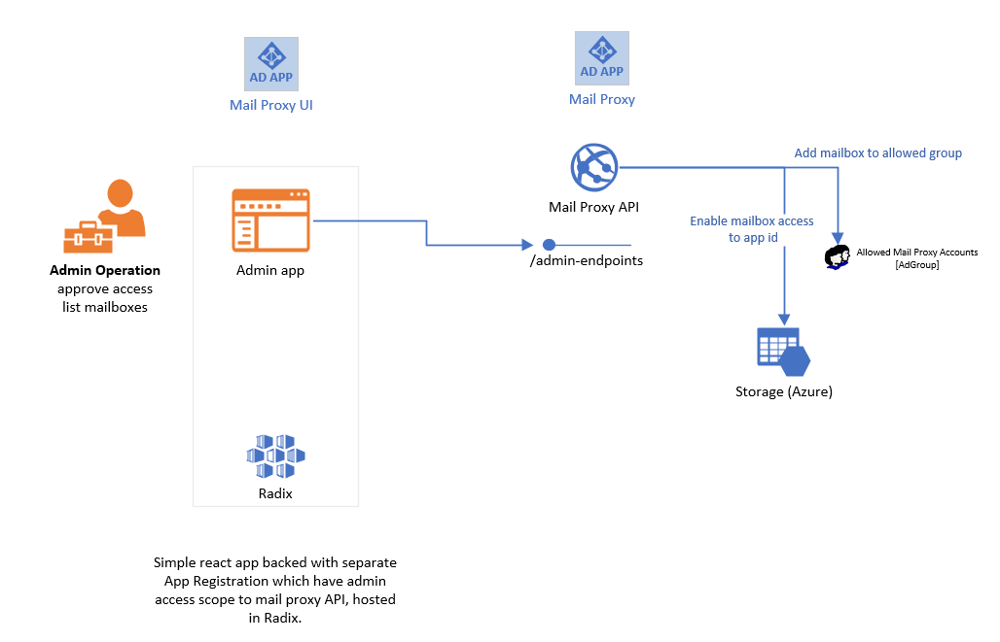

# Graph API Proxy

The api acts as a reverse proxy for the graph api, allowing additional access logic to be implemented.

## Background

The graph api access model can some time be way too 'elevated' for normal business applications.

A mitigation has been implemented by the exchange team, where app access can be locked down to specific users/groups, however the business application must still be granted the elevated app access, granting access to *all* users. This could show up in internal audits, without a direct link to the exchange access scoping. 

> The change subscription feature is not restricted by the exchange access scoping, allowing the app to set up change subscription to any user mailbox. This will however not leak any data, except for the knowledge of the mail id and the fact that a mail has been received.


## YARP 'middleware'

This is done by using the microsoft [YARP](https://microsoft.github.io/reverse-proxy/index.html) project (yet another reverse proxy) which easily integrates with asp.net core.

By using the 'direct proxy' functionality of the YARP library, we can expose specific url paths we want to forward, while having the possibility to evaluate both URI path, payload and response before forwarding.
This allows for evaluate the access token of the calling app, to see if we want to give the app access to manipulate the resource path, then forward the call to the graph api, using a new access token, which have elevated privileges.

## Features

- Expose all /{version}/users/{UPN}/* endpoints of graph api
- Expose /{versions}/subscriptions methods

### User resources

The api exposes all endpoints below the user, to access resources like `/messages` `/calendars` `/events` etc. These are exposed using a wide scope, and letting the backing `Azure AD app registration` control what the proxy is allowed to access. Ex `Mail.Read` will only allow access to the `/messages` resource. 


### Subscriptions

We expose the `/subscriptions` endpoint to investigate which resources the caller tries to subscribe to. This allows us to restrict which mailboxes the business application is allowed to monitor, which the exchange access scoping does not.

The body payload in the POST call is intercepted and parsed, looking for the `{ "resource": "/users/{UPN}/messages", ... }` part to extract the `UPN`. This is then verified with the allowed list for the `appid`.

This lets us control which resources we allow subscriptions created for.

> **Limitations**
>
> There is a limitations on how many subscriptions a single app registration is allowed to created, in each tenant. This seems to be at 100 pr app pr tenant, with a total limit of 5000 (?). My interpretation is that since we're working in one tenant, our limit is 100.

# Technical

The implementation is very low in complexity and maintenance, as there is not much code at all. We do not have to handle the payloads going back and forth. The business applications can implement their own code as if they were integrating with the graph api. 



## Access control

The proxy app is authorized by a separate Azure AD app registration. The business applications should be granted access to the different roles exposed. 

The `appid` claim is extracted from the incoming access token to identify the business application. A configuration is maintained by the api, specifying which `UPN`s the application is is allowed to access.

The `UPN` is extracted from the resource path, which is easily accessible since we are defining this resource path using tokens in our endpoint mapping.

```csharp
endpoints.Map("/{version}/users/{UPN}/{**catch-all}", httpContext => {
   var upn = httpContext.Request.RouteValues["UPN"] as string;
   var appid = httpContext.User.FindFirstValue("appid");
   // ... authorize logic
}
```

For subscriptions the UPN is checked by parsing the incoming payload, looking for the `resource` property.

## Configuration

The api will have to authorize as the app registration, not MSI. This is due the fact we need to grant Graph API access (although this can be done with powershell using the object id of the msi sp, but it will introduce a non-visual complexity). As we also want to combine this access restriction with the Exchange access scoping, we need an application id for those powershell calls.

We are for now just using a json file deployed to the api for `appid -> UPN` setup. This can easily be extended to be a storage account etc. However we would need some sort of management app/endpoints for that.

### Roles
The application requires the role `Proxy.Exchange.ReadWrite` for access to user resources. The resource types allowed to access is controlled by which scopes the proxy ad application is granted on the graph api.

As there is a limit to how many subscriptions we can have, this has been split out to a separate access role; `Proxy.Subscriptions`.

## Exchange Access Scoping

We should also limit the proxy app to only have access to the `UPN`s that should be granted access to, as this could potentially give access to much sensitive data. Instead of setting this up as `appid -> upn` we could create an AD group that the proxy app is allowed to access. This allows us to only run the remote exchange powershell commands only once. It also sets us up for future management through the api itself (as the app can be owner of the ad group, to allow membership management).

## Management solution proposal

We can expose simple management by creating a lightweight react app which signs the user in to a separate AD app. The Mail proxy app should also expose a user role, ex. `Proxy.Admin` which can be assigned to the admin users, or a azure ad role *(think this is possible?)*.



# Telemetry

This proxy allows us to collect and view what mailboxes the different applications actually accesses and actions performed, by appending the key identifiers the to telemetry pushed to AI.

# Considerations / Discussion

- We will lose the direct connection of the business app to the 'actor' on the graph api. 
- Delegate permissions would not really make any sense, so should be an app only api.
- In cases there are limitations pr app, we could have issues, like subscriptions
- For now, YARP is in preview, and a v1 milestone does not have a specific date

# Resources

- https://microsoft.github.io/reverse-proxy/index.html
- https://github.com/microsoft/reverse-proxy/releases
- https://docs.microsoft.com/en-us/graph/auth-limit-mailbox-access?view=graph-rest-1.0

